# Supply Chain

Based on the data from [@eseidel](https://github.com/eseidel/space_traders/blob/main/packages/cli/static_data/exports.json)

2024-02-12: Adapted to latest changes announced by [space-admiral on discord](https://discord.com/channels/792864705139048469/1206286843579080807/1206289418898382919) and in the [changelog](https://docs.spacetraders.io/resources/changelog#february-10-2024).

## ADVANCED_CIRCUITRY

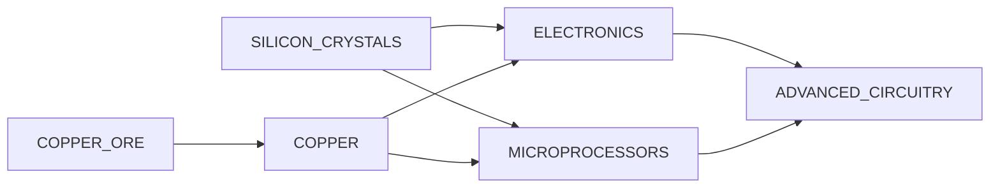

## AI_MAINFRAMES

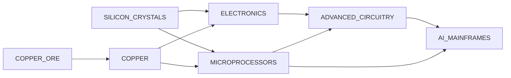

## ALUMINUM


## AMMUNITION

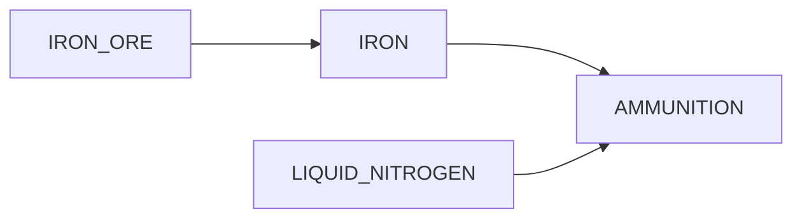

## ANTIMATTER

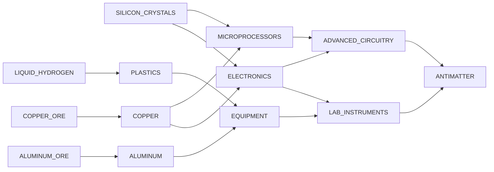

## ASSAULT_RIFLES

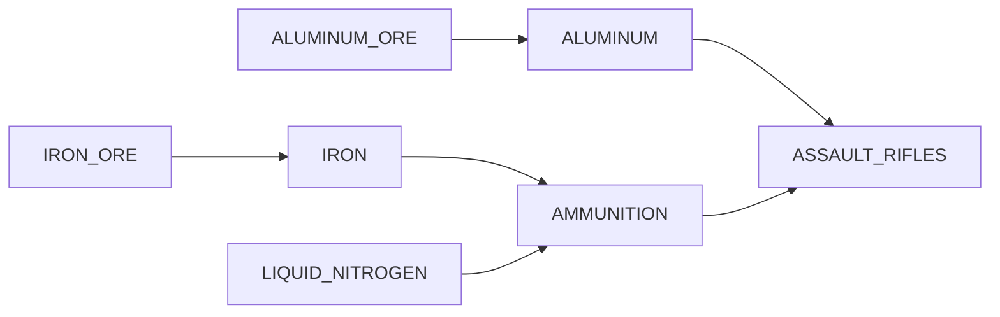

## BIOCOMPOSITES

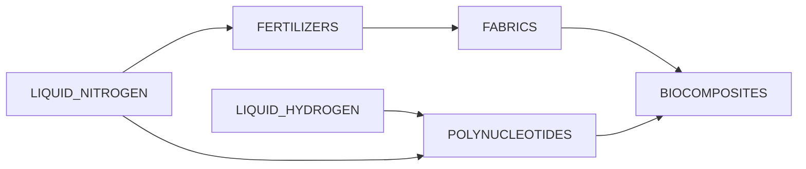

## BOTANICAL_SPECIMENS

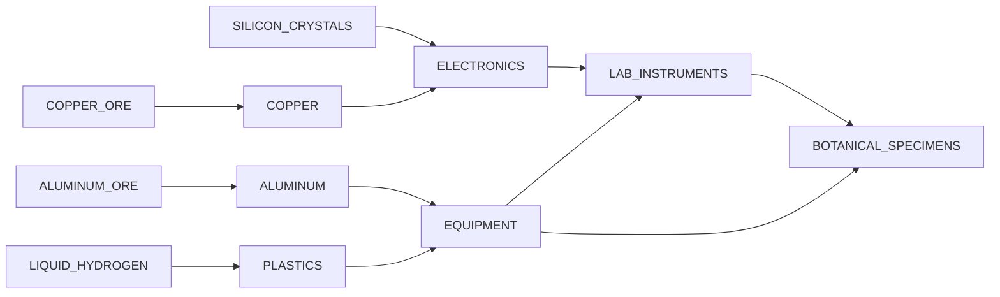

## CLOTHING


## COPPER


## CULTURAL_ARTIFACTS

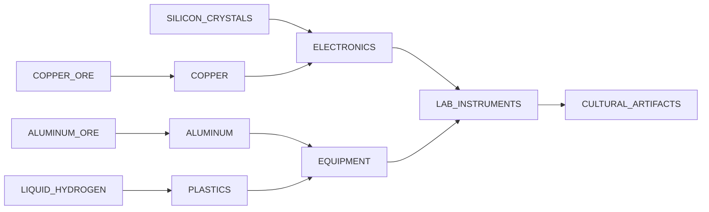

## CYBER_IMPLANTS

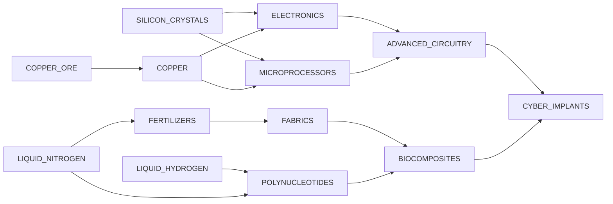

## DRUGS

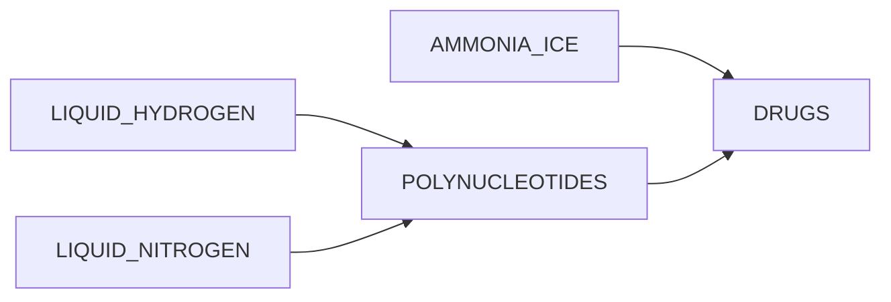

## ELECTRONICS

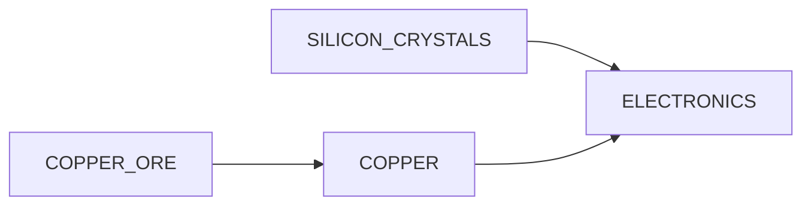

## ENGINE_HYPER_DRIVE_I

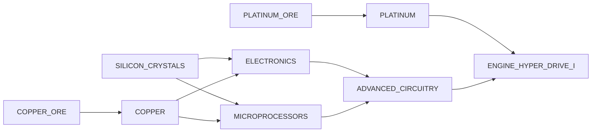

## ENGINE_IMPULSE_DRIVE_I


## ENGINE_ION_DRIVE_I


## ENGINE_ION_DRIVE_II


## EQUIPMENT

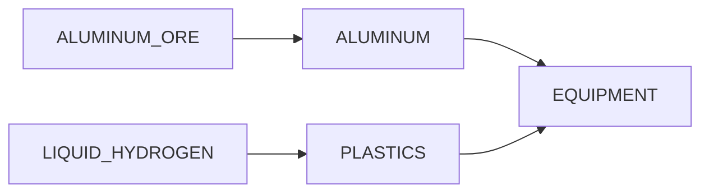

## EXOTIC_MATTER

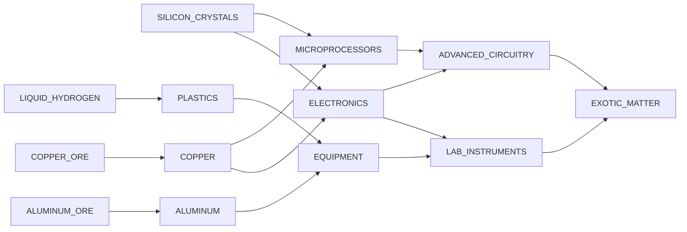

## EXPLOSIVES

```mermaid

graph LR;
  LIQUID_HYDROGEN --> EXPLOSIVES
  LIQUID_NITROGEN --> EXPLOSIVES

```

## FABRICS

```mermaid

graph LR;
  FERTILIZERS --> FABRICS
  LIQUID_NITROGEN --> FERTILIZERS

```

## FAB_MATS

```mermaid

graph LR;
  IRON --> FAB_MATS
  QUARTZ_SAND --> FAB_MATS
  IRON_ORE --> IRON

```

## FERTILIZERS

```mermaid

graph LR;
  LIQUID_NITROGEN --> FERTILIZERS

```

## FIREARMS

```mermaid

graph LR;
  IRON --> FIREARMS
  AMMUNITION --> FIREARMS
  IRON_ORE --> IRON
  IRON --> AMMUNITION
  LIQUID_NITROGEN --> AMMUNITION

```

## FOOD

```mermaid

graph LR;
  FERTILIZERS --> FOOD
  LIQUID_NITROGEN --> FERTILIZERS

```

## FUEL

```mermaid

graph LR;
  HYDROCARBON --> FUEL

```

## GENE_THERAPEUTICS

```mermaid

graph LR;
  POLYNUCLEOTIDES --> GENE_THERAPEUTICS
  LAB_INSTRUMENTS --> GENE_THERAPEUTICS
  LIQUID_HYDROGEN --> POLYNUCLEOTIDES
  LIQUID_NITROGEN --> POLYNUCLEOTIDES
  ELECTRONICS --> LAB_INSTRUMENTS
  EQUIPMENT --> LAB_INSTRUMENTS
  SILICON_CRYSTALS --> ELECTRONICS
  COPPER --> ELECTRONICS
  ALUMINUM --> EQUIPMENT
  PLASTICS --> EQUIPMENT
  COPPER_ORE --> COPPER
  ALUMINUM_ORE --> ALUMINUM
  LIQUID_HYDROGEN --> PLASTICS

```

## GOLD

```mermaid

graph LR;
  GOLD_ORE --> GOLD

```

## GRAVITON_EMITTERS

```mermaid

graph LR;
  ADVANCED_CIRCUITRY --> GRAVITON_EMITTERS
  GOLD --> GRAVITON_EMITTERS
  ELECTRONICS --> ADVANCED_CIRCUITRY
  MICROPROCESSORS --> ADVANCED_CIRCUITRY
  GOLD_ORE --> GOLD
  SILICON_CRYSTALS --> ELECTRONICS
  COPPER --> ELECTRONICS
  SILICON_CRYSTALS --> MICROPROCESSORS
  COPPER --> MICROPROCESSORS
  COPPER_ORE --> COPPER

```

## HOLOGRAPHICS

```mermaid

graph LR;
  GOLD --> HOLOGRAPHICS
  SILVER --> HOLOGRAPHICS
  ADVANCED_CIRCUITRY --> HOLOGRAPHICS
  GOLD_ORE --> GOLD
  SILVER_ORE --> SILVER
  ELECTRONICS --> ADVANCED_CIRCUITRY
  MICROPROCESSORS --> ADVANCED_CIRCUITRY
  SILICON_CRYSTALS --> ELECTRONICS
  COPPER --> ELECTRONICS
  SILICON_CRYSTALS --> MICROPROCESSORS
  COPPER --> MICROPROCESSORS
  COPPER_ORE --> COPPER

```

## IRON

```mermaid

graph LR;
  IRON_ORE --> IRON

```

## JEWELRY

```mermaid

graph LR;
  GOLD --> JEWELRY
  SILVER --> JEWELRY
  PRECIOUS_STONES --> JEWELRY
  DIAMONDS --> JEWELRY
  GOLD_ORE --> GOLD
  SILVER_ORE --> SILVER

```

## LAB_INSTRUMENTS

```mermaid

graph LR;
  ELECTRONICS --> LAB_INSTRUMENTS
  EQUIPMENT --> LAB_INSTRUMENTS
  SILICON_CRYSTALS --> ELECTRONICS
  COPPER --> ELECTRONICS
  ALUMINUM --> EQUIPMENT
  PLASTICS --> EQUIPMENT
  COPPER_ORE --> COPPER
  ALUMINUM_ORE --> ALUMINUM
  LIQUID_HYDROGEN --> PLASTICS

```

## LASER_RIFLES

```mermaid

graph LR;
  DIAMONDS --> LASER_RIFLES
  PLATINUM --> LASER_RIFLES
  ADVANCED_CIRCUITRY --> LASER_RIFLES
  PLATINUM_ORE --> PLATINUM
  ELECTRONICS --> ADVANCED_CIRCUITRY
  MICROPROCESSORS --> ADVANCED_CIRCUITRY
  SILICON_CRYSTALS --> ELECTRONICS
  COPPER --> ELECTRONICS
  SILICON_CRYSTALS --> MICROPROCESSORS
  COPPER --> MICROPROCESSORS
  COPPER_ORE --> COPPER

```

## MACHINERY

```mermaid

graph LR;
  IRON --> MACHINERY
  IRON_ORE --> IRON

```

## MEDICINE

```mermaid

graph LR;
  FABRICS --> MEDICINE
  POLYNUCLEOTIDES --> MEDICINE
  FERTILIZERS --> FABRICS
  LIQUID_HYDROGEN --> POLYNUCLEOTIDES
  LIQUID_NITROGEN --> POLYNUCLEOTIDES
  LIQUID_NITROGEN --> FERTILIZERS

```

## MERITIUM

```mermaid

graph LR;
  MERITIUM_ORE --> MERITIUM

```

## MICROPROCESSORS

```mermaid

graph LR;
  SILICON_CRYSTALS --> MICROPROCESSORS
  COPPER --> MICROPROCESSORS
  COPPER_ORE --> COPPER

```

## MICRO_FUSION_GENERATORS

```mermaid

graph LR;
  ADVANCED_CIRCUITRY --> MICRO_FUSION_GENERATORS
  PLATINUM --> MICRO_FUSION_GENERATORS
  DIAMONDS --> MICRO_FUSION_GENERATORS
  ELECTRONICS --> ADVANCED_CIRCUITRY
  MICROPROCESSORS --> ADVANCED_CIRCUITRY
  PLATINUM_ORE --> PLATINUM
  SILICON_CRYSTALS --> ELECTRONICS
  COPPER --> ELECTRONICS
  SILICON_CRYSTALS --> MICROPROCESSORS
  COPPER --> MICROPROCESSORS
  COPPER_ORE --> COPPER

```

## MILITARY_EQUIPMENT

```mermaid

graph LR;
  ALUMINUM --> MILITARY_EQUIPMENT
  ELECTRONICS --> MILITARY_EQUIPMENT
  ALUMINUM_ORE --> ALUMINUM
  SILICON_CRYSTALS --> ELECTRONICS
  COPPER --> ELECTRONICS
  COPPER_ORE --> COPPER

```

## MODULE_CARGO_HOLD_I

```mermaid

graph LR;
  IRON --> MODULE_CARGO_HOLD_I
  MACHINERY --> MODULE_CARGO_HOLD_I
  IRON_ORE --> IRON
  IRON --> MACHINERY

```

## MODULE_CARGO_HOLD_II

```mermaid

graph LR;
  ALUMINUM --> MODULE_CARGO_HOLD_II
  MACHINERY --> MODULE_CARGO_HOLD_II
  ALUMINUM_ORE --> ALUMINUM
  IRON --> MACHINERY
  IRON_ORE --> IRON

```

## MODULE_CARGO_HOLD_III

```mermaid

graph LR;
  PLATINUM --> MODULE_CARGO_HOLD_III
  MACHINERY --> MODULE_CARGO_HOLD_III
  ADVANCED_CIRCUITRY --> MODULE_CARGO_HOLD_III
  PLATINUM_ORE --> PLATINUM
  IRON --> MACHINERY
  ELECTRONICS --> ADVANCED_CIRCUITRY
  MICROPROCESSORS --> ADVANCED_CIRCUITRY
  IRON_ORE --> IRON
  SILICON_CRYSTALS --> ELECTRONICS
  COPPER --> ELECTRONICS
  SILICON_CRYSTALS --> MICROPROCESSORS
  COPPER --> MICROPROCESSORS
  COPPER_ORE --> COPPER

```

## MODULE_CREW_QUARTERS_I

```mermaid

graph LR;
  IRON --> MODULE_CREW_QUARTERS_I
  MACHINERY --> MODULE_CREW_QUARTERS_I
  FABRICS --> MODULE_CREW_QUARTERS_I
  IRON_ORE --> IRON
  IRON --> MACHINERY
  FERTILIZERS --> FABRICS
  LIQUID_NITROGEN --> FERTILIZERS

```

## MODULE_ENVOY_QUARTERS_I

```mermaid

graph LR;
  IRON --> MODULE_ENVOY_QUARTERS_I
  MACHINERY --> MODULE_ENVOY_QUARTERS_I
  FABRICS --> MODULE_ENVOY_QUARTERS_I
  IRON_ORE --> IRON
  IRON --> MACHINERY
  FERTILIZERS --> FABRICS
  LIQUID_NITROGEN --> FERTILIZERS

```

## MODULE_FUEL_REFINERY_I

```mermaid

graph LR;
  PLATINUM --> MODULE_FUEL_REFINERY_I
  MACHINERY --> MODULE_FUEL_REFINERY_I
  PLATINUM_ORE --> PLATINUM
  IRON --> MACHINERY
  IRON_ORE --> IRON

```

## MODULE_GAS_PROCESSOR_I

```mermaid

graph LR;
  IRON --> MODULE_GAS_PROCESSOR_I
  MACHINERY --> MODULE_GAS_PROCESSOR_I
  IRON_ORE --> IRON
  IRON --> MACHINERY

```

## MODULE_JUMP_DRIVE_I

```mermaid

graph LR;
  IRON --> MODULE_JUMP_DRIVE_I
  ADVANCED_CIRCUITRY --> MODULE_JUMP_DRIVE_I
  IRON_ORE --> IRON
  ELECTRONICS --> ADVANCED_CIRCUITRY
  MICROPROCESSORS --> ADVANCED_CIRCUITRY
  SILICON_CRYSTALS --> ELECTRONICS
  COPPER --> ELECTRONICS
  SILICON_CRYSTALS --> MICROPROCESSORS
  COPPER --> MICROPROCESSORS
  COPPER_ORE --> COPPER

```

## MODULE_JUMP_DRIVE_II

```mermaid

graph LR;
  PLATINUM --> MODULE_JUMP_DRIVE_II
  ADVANCED_CIRCUITRY --> MODULE_JUMP_DRIVE_II
  GOLD --> MODULE_JUMP_DRIVE_II
  PLATINUM_ORE --> PLATINUM
  ELECTRONICS --> ADVANCED_CIRCUITRY
  MICROPROCESSORS --> ADVANCED_CIRCUITRY
  GOLD_ORE --> GOLD
  SILICON_CRYSTALS --> ELECTRONICS
  COPPER --> ELECTRONICS
  SILICON_CRYSTALS --> MICROPROCESSORS
  COPPER --> MICROPROCESSORS
  COPPER_ORE --> COPPER

```

## MODULE_JUMP_DRIVE_III

```mermaid

graph LR;
  PLATINUM --> MODULE_JUMP_DRIVE_III
  ADVANCED_CIRCUITRY --> MODULE_JUMP_DRIVE_III
  GOLD --> MODULE_JUMP_DRIVE_III
  MERITIUM --> MODULE_JUMP_DRIVE_III
  PLATINUM_ORE --> PLATINUM
  ELECTRONICS --> ADVANCED_CIRCUITRY
  MICROPROCESSORS --> ADVANCED_CIRCUITRY
  GOLD_ORE --> GOLD
  MERITIUM_ORE --> MERITIUM
  SILICON_CRYSTALS --> ELECTRONICS
  COPPER --> ELECTRONICS
  SILICON_CRYSTALS --> MICROPROCESSORS
  COPPER --> MICROPROCESSORS
  COPPER_ORE --> COPPER

```

## MODULE_MICRO_REFINERY_I

```mermaid

graph LR;
  PLATINUM --> MODULE_MICRO_REFINERY_I
  MACHINERY --> MODULE_MICRO_REFINERY_I
  PLATINUM_ORE --> PLATINUM
  IRON --> MACHINERY
  IRON_ORE --> IRON

```

## MODULE_MINERAL_PROCESSOR_I

```mermaid

graph LR;
  IRON --> MODULE_MINERAL_PROCESSOR_I
  MACHINERY --> MODULE_MINERAL_PROCESSOR_I
  IRON_ORE --> IRON
  IRON --> MACHINERY

```

## MODULE_ORE_REFINERY_I

```mermaid

graph LR;
  PLATINUM --> MODULE_ORE_REFINERY_I
  MACHINERY --> MODULE_ORE_REFINERY_I
  PLATINUM_ORE --> PLATINUM
  IRON --> MACHINERY
  IRON_ORE --> IRON

```

## MODULE_PASSENGER_CABIN_I

```mermaid

graph LR;
  IRON --> MODULE_PASSENGER_CABIN_I
  MACHINERY --> MODULE_PASSENGER_CABIN_I
  FABRICS --> MODULE_PASSENGER_CABIN_I
  IRON_ORE --> IRON
  IRON --> MACHINERY
  FERTILIZERS --> FABRICS
  LIQUID_NITROGEN --> FERTILIZERS

```

## MODULE_SCIENCE_LAB_I

```mermaid

graph LR;
  PLATINUM --> MODULE_SCIENCE_LAB_I
  MACHINERY --> MODULE_SCIENCE_LAB_I
  ADVANCED_CIRCUITRY --> MODULE_SCIENCE_LAB_I
  PLATINUM_ORE --> PLATINUM
  IRON --> MACHINERY
  ELECTRONICS --> ADVANCED_CIRCUITRY
  MICROPROCESSORS --> ADVANCED_CIRCUITRY
  IRON_ORE --> IRON
  SILICON_CRYSTALS --> ELECTRONICS
  COPPER --> ELECTRONICS
  SILICON_CRYSTALS --> MICROPROCESSORS
  COPPER --> MICROPROCESSORS
  COPPER_ORE --> COPPER

```

## MODULE_SHIELD_GENERATOR_I

```mermaid

graph LR;
  IRON --> MODULE_SHIELD_GENERATOR_I
  MACHINERY --> MODULE_SHIELD_GENERATOR_I
  URANITE --> MODULE_SHIELD_GENERATOR_I
  IRON_ORE --> IRON
  IRON --> MACHINERY
  URANITE_ORE --> URANITE

```

## MODULE_SHIELD_GENERATOR_II

```mermaid

graph LR;
  ALUMINUM --> MODULE_SHIELD_GENERATOR_II
  MACHINERY --> MODULE_SHIELD_GENERATOR_II
  URANITE --> MODULE_SHIELD_GENERATOR_II
  ALUMINUM_ORE --> ALUMINUM
  IRON --> MACHINERY
  URANITE_ORE --> URANITE
  IRON_ORE --> IRON

```

## MODULE_WARP_DRIVE_I

```mermaid

graph LR;
  IRON --> MODULE_WARP_DRIVE_I
  ADVANCED_CIRCUITRY --> MODULE_WARP_DRIVE_I
  IRON_ORE --> IRON
  ELECTRONICS --> ADVANCED_CIRCUITRY
  MICROPROCESSORS --> ADVANCED_CIRCUITRY
  SILICON_CRYSTALS --> ELECTRONICS
  COPPER --> ELECTRONICS
  SILICON_CRYSTALS --> MICROPROCESSORS
  COPPER --> MICROPROCESSORS
  COPPER_ORE --> COPPER

```

## MODULE_WARP_DRIVE_II

```mermaid

graph LR;
  PLATINUM --> MODULE_WARP_DRIVE_II
  ADVANCED_CIRCUITRY --> MODULE_WARP_DRIVE_II
  URANITE --> MODULE_WARP_DRIVE_II
  PLATINUM_ORE --> PLATINUM
  ELECTRONICS --> ADVANCED_CIRCUITRY
  MICROPROCESSORS --> ADVANCED_CIRCUITRY
  URANITE_ORE --> URANITE
  SILICON_CRYSTALS --> ELECTRONICS
  COPPER --> ELECTRONICS
  SILICON_CRYSTALS --> MICROPROCESSORS
  COPPER --> MICROPROCESSORS
  COPPER_ORE --> COPPER

```

## MODULE_WARP_DRIVE_III

```mermaid

graph LR;
  PLATINUM --> MODULE_WARP_DRIVE_III
  ADVANCED_CIRCUITRY --> MODULE_WARP_DRIVE_III
  MERITIUM --> MODULE_WARP_DRIVE_III
  PLATINUM_ORE --> PLATINUM
  ELECTRONICS --> ADVANCED_CIRCUITRY
  MICROPROCESSORS --> ADVANCED_CIRCUITRY
  MERITIUM_ORE --> MERITIUM
  SILICON_CRYSTALS --> ELECTRONICS
  COPPER --> ELECTRONICS
  SILICON_CRYSTALS --> MICROPROCESSORS
  COPPER --> MICROPROCESSORS
  COPPER_ORE --> COPPER

```

## MOOD_REGULATORS

```mermaid

graph LR;
  POLYNUCLEOTIDES --> MOOD_REGULATORS
  LAB_INSTRUMENTS --> MOOD_REGULATORS
  LIQUID_HYDROGEN --> POLYNUCLEOTIDES
  LIQUID_NITROGEN --> POLYNUCLEOTIDES
  ELECTRONICS --> LAB_INSTRUMENTS
  EQUIPMENT --> LAB_INSTRUMENTS
  SILICON_CRYSTALS --> ELECTRONICS
  COPPER --> ELECTRONICS
  ALUMINUM --> EQUIPMENT
  PLASTICS --> EQUIPMENT
  COPPER_ORE --> COPPER
  ALUMINUM_ORE --> ALUMINUM
  LIQUID_HYDROGEN --> PLASTICS

```

## MOUNT_GAS_SIPHON_I

```mermaid

graph LR;
  IRON --> MOUNT_GAS_SIPHON_I
  MACHINERY --> MOUNT_GAS_SIPHON_I
  IRON_ORE --> IRON
  IRON --> MACHINERY

```

## MOUNT_GAS_SIPHON_II

```mermaid

graph LR;
  ALUMINUM --> MOUNT_GAS_SIPHON_II
  MACHINERY --> MOUNT_GAS_SIPHON_II
  ALUMINUM_ORE --> ALUMINUM
  IRON --> MACHINERY
  IRON_ORE --> IRON

```

## MOUNT_GAS_SIPHON_III

```mermaid

graph LR;
  PLATINUM --> MOUNT_GAS_SIPHON_III
  MACHINERY --> MOUNT_GAS_SIPHON_III
  ADVANCED_CIRCUITRY --> MOUNT_GAS_SIPHON_III
  PLATINUM_ORE --> PLATINUM
  IRON --> MACHINERY
  ELECTRONICS --> ADVANCED_CIRCUITRY
  MICROPROCESSORS --> ADVANCED_CIRCUITRY
  IRON_ORE --> IRON
  SILICON_CRYSTALS --> ELECTRONICS
  COPPER --> ELECTRONICS
  SILICON_CRYSTALS --> MICROPROCESSORS
  COPPER --> MICROPROCESSORS
  COPPER_ORE --> COPPER

```

## MOUNT_LASER_CANNON_I

```mermaid

graph LR;
  IRON --> MOUNT_LASER_CANNON_I
  MACHINERY --> MOUNT_LASER_CANNON_I
  DIAMONDS --> MOUNT_LASER_CANNON_I
  IRON_ORE --> IRON
  IRON --> MACHINERY

```

## MOUNT_MINING_LASER_I

```mermaid

graph LR;
  IRON --> MOUNT_MINING_LASER_I
  MACHINERY --> MOUNT_MINING_LASER_I
  DIAMONDS --> MOUNT_MINING_LASER_I
  IRON_ORE --> IRON
  IRON --> MACHINERY

```

## MOUNT_MINING_LASER_II

```mermaid

graph LR;
  ALUMINUM --> MOUNT_MINING_LASER_II
  MACHINERY --> MOUNT_MINING_LASER_II
  DIAMONDS --> MOUNT_MINING_LASER_II
  ALUMINUM_ORE --> ALUMINUM
  IRON --> MACHINERY
  IRON_ORE --> IRON

```

## MOUNT_MINING_LASER_III

```mermaid

graph LR;
  PLATINUM --> MOUNT_MINING_LASER_III
  MACHINERY --> MOUNT_MINING_LASER_III
  ADVANCED_CIRCUITRY --> MOUNT_MINING_LASER_III
  URANITE --> MOUNT_MINING_LASER_III
  PLATINUM_ORE --> PLATINUM
  IRON --> MACHINERY
  ELECTRONICS --> ADVANCED_CIRCUITRY
  MICROPROCESSORS --> ADVANCED_CIRCUITRY
  URANITE_ORE --> URANITE
  IRON_ORE --> IRON
  SILICON_CRYSTALS --> ELECTRONICS
  COPPER --> ELECTRONICS
  SILICON_CRYSTALS --> MICROPROCESSORS
  COPPER --> MICROPROCESSORS
  COPPER_ORE --> COPPER

```

## MOUNT_MISSILE_LAUNCHER_I

```mermaid

graph LR;
  IRON --> MOUNT_MISSILE_LAUNCHER_I
  MACHINERY --> MOUNT_MISSILE_LAUNCHER_I
  IRON_ORE --> IRON
  IRON --> MACHINERY

```

## MOUNT_SENSOR_ARRAY_I

```mermaid

graph LR;
  IRON --> MOUNT_SENSOR_ARRAY_I
  MACHINERY --> MOUNT_SENSOR_ARRAY_I
  ELECTRONICS --> MOUNT_SENSOR_ARRAY_I
  IRON_ORE --> IRON
  IRON --> MACHINERY
  SILICON_CRYSTALS --> ELECTRONICS
  COPPER --> ELECTRONICS
  COPPER_ORE --> COPPER

```

## MOUNT_SENSOR_ARRAY_II

```mermaid

graph LR;
  ALUMINUM --> MOUNT_SENSOR_ARRAY_II
  MACHINERY --> MOUNT_SENSOR_ARRAY_II
  ELECTRONICS --> MOUNT_SENSOR_ARRAY_II
  ALUMINUM_ORE --> ALUMINUM
  IRON --> MACHINERY
  SILICON_CRYSTALS --> ELECTRONICS
  COPPER --> ELECTRONICS
  IRON_ORE --> IRON
  COPPER_ORE --> COPPER

```

## MOUNT_SENSOR_ARRAY_III

```mermaid

graph LR;
  PLATINUM --> MOUNT_SENSOR_ARRAY_III
  MACHINERY --> MOUNT_SENSOR_ARRAY_III
  ADVANCED_CIRCUITRY --> MOUNT_SENSOR_ARRAY_III
  URANITE --> MOUNT_SENSOR_ARRAY_III
  PLATINUM_ORE --> PLATINUM
  IRON --> MACHINERY
  ELECTRONICS --> ADVANCED_CIRCUITRY
  MICROPROCESSORS --> ADVANCED_CIRCUITRY
  URANITE_ORE --> URANITE
  IRON_ORE --> IRON
  SILICON_CRYSTALS --> ELECTRONICS
  COPPER --> ELECTRONICS
  SILICON_CRYSTALS --> MICROPROCESSORS
  COPPER --> MICROPROCESSORS
  COPPER_ORE --> COPPER

```

## MOUNT_SURVEYOR_I

```mermaid

graph LR;
  IRON --> MOUNT_SURVEYOR_I
  MACHINERY --> MOUNT_SURVEYOR_I
  ELECTRONICS --> MOUNT_SURVEYOR_I
  IRON_ORE --> IRON
  IRON --> MACHINERY
  SILICON_CRYSTALS --> ELECTRONICS
  COPPER --> ELECTRONICS
  COPPER_ORE --> COPPER

```

## MOUNT_SURVEYOR_II

```mermaid

graph LR;
  ALUMINUM --> MOUNT_SURVEYOR_II
  MACHINERY --> MOUNT_SURVEYOR_II
  ELECTRONICS --> MOUNT_SURVEYOR_II
  ALUMINUM_ORE --> ALUMINUM
  IRON --> MACHINERY
  SILICON_CRYSTALS --> ELECTRONICS
  COPPER --> ELECTRONICS
  IRON_ORE --> IRON
  COPPER_ORE --> COPPER

```

## MOUNT_SURVEYOR_III

```mermaid

graph LR;
  PLATINUM --> MOUNT_SURVEYOR_III
  MACHINERY --> MOUNT_SURVEYOR_III
  ADVANCED_CIRCUITRY --> MOUNT_SURVEYOR_III
  PLATINUM_ORE --> PLATINUM
  IRON --> MACHINERY
  ELECTRONICS --> ADVANCED_CIRCUITRY
  MICROPROCESSORS --> ADVANCED_CIRCUITRY
  IRON_ORE --> IRON
  SILICON_CRYSTALS --> ELECTRONICS
  COPPER --> ELECTRONICS
  SILICON_CRYSTALS --> MICROPROCESSORS
  COPPER --> MICROPROCESSORS
  COPPER_ORE --> COPPER

```

## MOUNT_TURRET_I

```mermaid

graph LR;
  IRON --> MOUNT_TURRET_I
  MACHINERY --> MOUNT_TURRET_I
  IRON_ORE --> IRON
  IRON --> MACHINERY

```

## NANOBOTS

```mermaid

graph LR;
  POLYNUCLEOTIDES --> NANOBOTS
  LAB_INSTRUMENTS --> NANOBOTS
  LIQUID_HYDROGEN --> POLYNUCLEOTIDES
  LIQUID_NITROGEN --> POLYNUCLEOTIDES
  ELECTRONICS --> LAB_INSTRUMENTS
  EQUIPMENT --> LAB_INSTRUMENTS
  SILICON_CRYSTALS --> ELECTRONICS
  COPPER --> ELECTRONICS
  ALUMINUM --> EQUIPMENT
  PLASTICS --> EQUIPMENT
  COPPER_ORE --> COPPER
  ALUMINUM_ORE --> ALUMINUM
  LIQUID_HYDROGEN --> PLASTICS

```

## NEURAL_CHIPS

```mermaid

graph LR;
  POLYNUCLEOTIDES --> NEURAL_CHIPS
  ADVANCED_CIRCUITRY --> NEURAL_CHIPS
  LIQUID_HYDROGEN --> POLYNUCLEOTIDES
  LIQUID_NITROGEN --> POLYNUCLEOTIDES
  ELECTRONICS --> ADVANCED_CIRCUITRY
  MICROPROCESSORS --> ADVANCED_CIRCUITRY
  SILICON_CRYSTALS --> ELECTRONICS
  COPPER --> ELECTRONICS
  SILICON_CRYSTALS --> MICROPROCESSORS
  COPPER --> MICROPROCESSORS
  COPPER_ORE --> COPPER

```

## NOVEL_LIFEFORMS

```mermaid

graph LR;
  LAB_INSTRUMENTS --> NOVEL_LIFEFORMS
  EQUIPMENT --> NOVEL_LIFEFORMS
  ELECTRONICS --> LAB_INSTRUMENTS
  EQUIPMENT --> LAB_INSTRUMENTS
  ALUMINUM --> EQUIPMENT
  PLASTICS --> EQUIPMENT
  SILICON_CRYSTALS --> ELECTRONICS
  COPPER --> ELECTRONICS
  ALUMINUM_ORE --> ALUMINUM
  LIQUID_HYDROGEN --> PLASTICS
  COPPER_ORE --> COPPER

```

## PLASTICS

```mermaid

graph LR;
  LIQUID_HYDROGEN --> PLASTICS

```

## PLATINUM

```mermaid

graph LR;
  PLATINUM_ORE --> PLATINUM

```

## POLYNUCLEOTIDES

```mermaid

graph LR;
  LIQUID_HYDROGEN --> POLYNUCLEOTIDES
  LIQUID_NITROGEN --> POLYNUCLEOTIDES

```

## QUANTUM_DRIVES

```mermaid

graph LR;
  ADVANCED_CIRCUITRY --> QUANTUM_DRIVES
  DIAMONDS --> QUANTUM_DRIVES
  ELECTRONICS --> ADVANCED_CIRCUITRY
  MICROPROCESSORS --> ADVANCED_CIRCUITRY
  SILICON_CRYSTALS --> ELECTRONICS
  COPPER --> ELECTRONICS
  SILICON_CRYSTALS --> MICROPROCESSORS
  COPPER --> MICROPROCESSORS
  COPPER_ORE --> COPPER

```

## QUANTUM_STABILIZERS

```mermaid

graph LR;
  PLATINUM --> QUANTUM_STABILIZERS
  ADVANCED_CIRCUITRY --> QUANTUM_STABILIZERS
  PLATINUM_ORE --> PLATINUM
  ELECTRONICS --> ADVANCED_CIRCUITRY
  MICROPROCESSORS --> ADVANCED_CIRCUITRY
  SILICON_CRYSTALS --> ELECTRONICS
  COPPER --> ELECTRONICS
  SILICON_CRYSTALS --> MICROPROCESSORS
  COPPER --> MICROPROCESSORS
  COPPER_ORE --> COPPER

```

## REACTOR_ANTIMATTER_I

```mermaid

graph LR;
  IRON --> REACTOR_ANTIMATTER_I
  MACHINERY --> REACTOR_ANTIMATTER_I
  IRON_ORE --> IRON
  IRON --> MACHINERY

```

## REACTOR_CHEMICAL_I

```mermaid

graph LR;
  IRON --> REACTOR_CHEMICAL_I
  MACHINERY --> REACTOR_CHEMICAL_I
  IRON_ORE --> IRON
  IRON --> MACHINERY

```

## REACTOR_FISSION_I

```mermaid

graph LR;
  IRON --> REACTOR_FISSION_I
  MACHINERY --> REACTOR_FISSION_I
  IRON_ORE --> IRON
  IRON --> MACHINERY

```

## REACTOR_FUSION_I

```mermaid

graph LR;
  IRON --> REACTOR_FUSION_I
  MACHINERY --> REACTOR_FUSION_I
  IRON_ORE --> IRON
  IRON --> MACHINERY

```

## REACTOR_SOLAR_I

```mermaid

graph LR;
  IRON --> REACTOR_SOLAR_I
  MACHINERY --> REACTOR_SOLAR_I
  IRON_ORE --> IRON
  IRON --> MACHINERY

```

## RELIC_TECH

```mermaid

graph LR;
  LAB_INSTRUMENTS --> RELIC_TECH
  EQUIPMENT --> RELIC_TECH
  ELECTRONICS --> LAB_INSTRUMENTS
  EQUIPMENT --> LAB_INSTRUMENTS
  ALUMINUM --> EQUIPMENT
  PLASTICS --> EQUIPMENT
  SILICON_CRYSTALS --> ELECTRONICS
  COPPER --> ELECTRONICS
  ALUMINUM_ORE --> ALUMINUM
  LIQUID_HYDROGEN --> PLASTICS
  COPPER_ORE --> COPPER

```

## ROBOTIC_DRONES

```mermaid

graph LR;
  ADVANCED_CIRCUITRY --> ROBOTIC_DRONES
  ALUMINUM --> ROBOTIC_DRONES
  ELECTRONICS --> ADVANCED_CIRCUITRY
  MICROPROCESSORS --> ADVANCED_CIRCUITRY
  ALUMINUM_ORE --> ALUMINUM
  SILICON_CRYSTALS --> ELECTRONICS
  COPPER --> ELECTRONICS
  SILICON_CRYSTALS --> MICROPROCESSORS
  COPPER --> MICROPROCESSORS
  COPPER_ORE --> COPPER

```

## SHIP_COMMAND_FRIGATE

```mermaid

graph LR;
  SHIP_PLATING --> SHIP_COMMAND_FRIGATE
  SHIP_PARTS --> SHIP_COMMAND_FRIGATE
  ALUMINUM --> SHIP_PLATING
  MACHINERY --> SHIP_PLATING
  EQUIPMENT --> SHIP_PARTS
  ELECTRONICS --> SHIP_PARTS
  ALUMINUM_ORE --> ALUMINUM
  IRON --> MACHINERY
  ALUMINUM --> EQUIPMENT
  PLASTICS --> EQUIPMENT
  SILICON_CRYSTALS --> ELECTRONICS
  COPPER --> ELECTRONICS
  IRON_ORE --> IRON
  LIQUID_HYDROGEN --> PLASTICS
  COPPER_ORE --> COPPER

```

## SHIP_EXPLORER

```mermaid

graph LR;
  SHIP_PLATING --> SHIP_EXPLORER
  SHIP_PARTS --> SHIP_EXPLORER
  ALUMINUM --> SHIP_PLATING
  MACHINERY --> SHIP_PLATING
  EQUIPMENT --> SHIP_PARTS
  ELECTRONICS --> SHIP_PARTS
  ALUMINUM_ORE --> ALUMINUM
  IRON --> MACHINERY
  ALUMINUM --> EQUIPMENT
  PLASTICS --> EQUIPMENT
  SILICON_CRYSTALS --> ELECTRONICS
  COPPER --> ELECTRONICS
  IRON_ORE --> IRON
  LIQUID_HYDROGEN --> PLASTICS
  COPPER_ORE --> COPPER

```

## SHIP_HEAVY_FREIGHTER

```mermaid

graph LR;
  SHIP_PLATING --> SHIP_HEAVY_FREIGHTER
  SHIP_PARTS --> SHIP_HEAVY_FREIGHTER
  ALUMINUM --> SHIP_PLATING
  MACHINERY --> SHIP_PLATING
  EQUIPMENT --> SHIP_PARTS
  ELECTRONICS --> SHIP_PARTS
  ALUMINUM_ORE --> ALUMINUM
  IRON --> MACHINERY
  ALUMINUM --> EQUIPMENT
  PLASTICS --> EQUIPMENT
  SILICON_CRYSTALS --> ELECTRONICS
  COPPER --> ELECTRONICS
  IRON_ORE --> IRON
  LIQUID_HYDROGEN --> PLASTICS
  COPPER_ORE --> COPPER

```

## SHIP_INTERCEPTOR

```mermaid

graph LR;
  SHIP_PLATING --> SHIP_INTERCEPTOR
  SHIP_PARTS --> SHIP_INTERCEPTOR
  ALUMINUM --> SHIP_PLATING
  MACHINERY --> SHIP_PLATING
  EQUIPMENT --> SHIP_PARTS
  ELECTRONICS --> SHIP_PARTS
  ALUMINUM_ORE --> ALUMINUM
  IRON --> MACHINERY
  ALUMINUM --> EQUIPMENT
  PLASTICS --> EQUIPMENT
  SILICON_CRYSTALS --> ELECTRONICS
  COPPER --> ELECTRONICS
  IRON_ORE --> IRON
  LIQUID_HYDROGEN --> PLASTICS
  COPPER_ORE --> COPPER

```

## SHIP_LIGHT_HAULER

```mermaid

graph LR;
  SHIP_PLATING --> SHIP_LIGHT_HAULER
  SHIP_PARTS --> SHIP_LIGHT_HAULER
  ALUMINUM --> SHIP_PLATING
  MACHINERY --> SHIP_PLATING
  EQUIPMENT --> SHIP_PARTS
  ELECTRONICS --> SHIP_PARTS
  ALUMINUM_ORE --> ALUMINUM
  IRON --> MACHINERY
  ALUMINUM --> EQUIPMENT
  PLASTICS --> EQUIPMENT
  SILICON_CRYSTALS --> ELECTRONICS
  COPPER --> ELECTRONICS
  IRON_ORE --> IRON
  LIQUID_HYDROGEN --> PLASTICS
  COPPER_ORE --> COPPER

```

## SHIP_LIGHT_SHUTTLE

```mermaid

graph LR;
  SHIP_PLATING --> SHIP_LIGHT_SHUTTLE
  SHIP_PARTS --> SHIP_LIGHT_SHUTTLE
  ALUMINUM --> SHIP_PLATING
  MACHINERY --> SHIP_PLATING
  EQUIPMENT --> SHIP_PARTS
  ELECTRONICS --> SHIP_PARTS
  ALUMINUM_ORE --> ALUMINUM
  IRON --> MACHINERY
  ALUMINUM --> EQUIPMENT
  PLASTICS --> EQUIPMENT
  SILICON_CRYSTALS --> ELECTRONICS
  COPPER --> ELECTRONICS
  IRON_ORE --> IRON
  LIQUID_HYDROGEN --> PLASTICS
  COPPER_ORE --> COPPER

```

## SHIP_MINING_DRONE

```mermaid

graph LR;
  SHIP_PLATING --> SHIP_MINING_DRONE
  SHIP_PARTS --> SHIP_MINING_DRONE
  ALUMINUM --> SHIP_PLATING
  MACHINERY --> SHIP_PLATING
  EQUIPMENT --> SHIP_PARTS
  ELECTRONICS --> SHIP_PARTS
  ALUMINUM_ORE --> ALUMINUM
  IRON --> MACHINERY
  ALUMINUM --> EQUIPMENT
  PLASTICS --> EQUIPMENT
  SILICON_CRYSTALS --> ELECTRONICS
  COPPER --> ELECTRONICS
  IRON_ORE --> IRON
  LIQUID_HYDROGEN --> PLASTICS
  COPPER_ORE --> COPPER

```

## SHIP_ORE_HOUND

```mermaid

graph LR;
  SHIP_PLATING --> SHIP_ORE_HOUND
  SHIP_PARTS --> SHIP_ORE_HOUND
  ALUMINUM --> SHIP_PLATING
  MACHINERY --> SHIP_PLATING
  EQUIPMENT --> SHIP_PARTS
  ELECTRONICS --> SHIP_PARTS
  ALUMINUM_ORE --> ALUMINUM
  IRON --> MACHINERY
  ALUMINUM --> EQUIPMENT
  PLASTICS --> EQUIPMENT
  SILICON_CRYSTALS --> ELECTRONICS
  COPPER --> ELECTRONICS
  IRON_ORE --> IRON
  LIQUID_HYDROGEN --> PLASTICS
  COPPER_ORE --> COPPER

```

## SHIP_PARTS

```mermaid

graph LR;
  EQUIPMENT --> SHIP_PARTS
  ELECTRONICS --> SHIP_PARTS
  ALUMINUM --> EQUIPMENT
  PLASTICS --> EQUIPMENT
  SILICON_CRYSTALS --> ELECTRONICS
  COPPER --> ELECTRONICS
  ALUMINUM_ORE --> ALUMINUM
  LIQUID_HYDROGEN --> PLASTICS
  COPPER_ORE --> COPPER

```

## SHIP_PLATING

```mermaid

graph LR;
  ALUMINUM --> SHIP_PLATING
  MACHINERY --> SHIP_PLATING
  ALUMINUM_ORE --> ALUMINUM
  IRON --> MACHINERY
  IRON_ORE --> IRON

```

## SHIP_PROBE

```mermaid

graph LR;
  SHIP_PLATING --> SHIP_PROBE
  SHIP_PARTS --> SHIP_PROBE
  ALUMINUM --> SHIP_PLATING
  MACHINERY --> SHIP_PLATING
  EQUIPMENT --> SHIP_PARTS
  ELECTRONICS --> SHIP_PARTS
  ALUMINUM_ORE --> ALUMINUM
  IRON --> MACHINERY
  ALUMINUM --> EQUIPMENT
  PLASTICS --> EQUIPMENT
  SILICON_CRYSTALS --> ELECTRONICS
  COPPER --> ELECTRONICS
  IRON_ORE --> IRON
  LIQUID_HYDROGEN --> PLASTICS
  COPPER_ORE --> COPPER

```

## SHIP_REFINING_FREIGHTER

```mermaid

graph LR;
  SHIP_PLATING --> SHIP_REFINING_FREIGHTER
  SHIP_PARTS --> SHIP_REFINING_FREIGHTER
  ALUMINUM --> SHIP_PLATING
  MACHINERY --> SHIP_PLATING
  EQUIPMENT --> SHIP_PARTS
  ELECTRONICS --> SHIP_PARTS
  ALUMINUM_ORE --> ALUMINUM
  IRON --> MACHINERY
  ALUMINUM --> EQUIPMENT
  PLASTICS --> EQUIPMENT
  SILICON_CRYSTALS --> ELECTRONICS
  COPPER --> ELECTRONICS
  IRON_ORE --> IRON
  LIQUID_HYDROGEN --> PLASTICS
  COPPER_ORE --> COPPER

```

## SHIP_SIPHON_DRONE

```mermaid

graph LR;
  SHIP_PLATING --> SHIP_SIPHON_DRONE
  SHIP_PARTS --> SHIP_SIPHON_DRONE
  ALUMINUM --> SHIP_PLATING
  MACHINERY --> SHIP_PLATING
  EQUIPMENT --> SHIP_PARTS
  ELECTRONICS --> SHIP_PARTS
  ALUMINUM_ORE --> ALUMINUM
  IRON --> MACHINERY
  ALUMINUM --> EQUIPMENT
  PLASTICS --> EQUIPMENT
  SILICON_CRYSTALS --> ELECTRONICS
  COPPER --> ELECTRONICS
  IRON_ORE --> IRON
  LIQUID_HYDROGEN --> PLASTICS
  COPPER_ORE --> COPPER

```

## SHIP_SURVEYOR

```mermaid

graph LR;
  SHIP_PLATING --> SHIP_SURVEYOR
  SHIP_PARTS --> SHIP_SURVEYOR
  ALUMINUM --> SHIP_PLATING
  MACHINERY --> SHIP_PLATING
  EQUIPMENT --> SHIP_PARTS
  ELECTRONICS --> SHIP_PARTS
  ALUMINUM_ORE --> ALUMINUM
  IRON --> MACHINERY
  ALUMINUM --> EQUIPMENT
  PLASTICS --> EQUIPMENT
  SILICON_CRYSTALS --> ELECTRONICS
  COPPER --> ELECTRONICS
  IRON_ORE --> IRON
  LIQUID_HYDROGEN --> PLASTICS
  COPPER_ORE --> COPPER

```

## SILVER

```mermaid

graph LR;
  SILVER_ORE --> SILVER

```

## SUPERGRAINS

```mermaid

graph LR;
  FERTILIZERS --> SUPERGRAINS
  POLYNUCLEOTIDES --> SUPERGRAINS
  LAB_INSTRUMENTS --> SUPERGRAINS
  LIQUID_NITROGEN --> FERTILIZERS
  LIQUID_HYDROGEN --> POLYNUCLEOTIDES
  LIQUID_NITROGEN --> POLYNUCLEOTIDES
  ELECTRONICS --> LAB_INSTRUMENTS
  EQUIPMENT --> LAB_INSTRUMENTS
  SILICON_CRYSTALS --> ELECTRONICS
  COPPER --> ELECTRONICS
  ALUMINUM --> EQUIPMENT
  PLASTICS --> EQUIPMENT
  COPPER_ORE --> COPPER
  ALUMINUM_ORE --> ALUMINUM
  LIQUID_HYDROGEN --> PLASTICS

```

## URANITE

```mermaid

graph LR;
  URANITE_ORE --> URANITE

```

## VIRAL_AGENTS

```mermaid

graph LR;
  POLYNUCLEOTIDES --> VIRAL_AGENTS
  LAB_INSTRUMENTS --> VIRAL_AGENTS
  LIQUID_HYDROGEN --> POLYNUCLEOTIDES
  LIQUID_NITROGEN --> POLYNUCLEOTIDES
  ELECTRONICS --> LAB_INSTRUMENTS
  EQUIPMENT --> LAB_INSTRUMENTS
  SILICON_CRYSTALS --> ELECTRONICS
  COPPER --> ELECTRONICS
  ALUMINUM --> EQUIPMENT
  PLASTICS --> EQUIPMENT
  COPPER_ORE --> COPPER
  ALUMINUM_ORE --> ALUMINUM
  LIQUID_HYDROGEN --> PLASTICS

```

Process finished with exit code 0
